# Tin-Can Radio Materials Purchased
- Source: Notion page `Tin-Can Radio Materials Purchased`
- Notion page ID: `386f753f-933b-80ab-8c45-e4aa9453154d`
- Exported by Hermes: `2026-06-21 13:30:38`
- Items extracted: `22`
- Images archived locally: `14` under `assets/notion-materials-purchased/`

## Material List
1. 电位器旋钮单圈碳膜电位器可调电阻2K欧姆 * 2
2. 松下 6*6*4.3 直插2脚方形轻触开关 * 50
3. 松下 6*6*5 直插2脚方形轻触开关 * 50
4. RDA5807M 收音模块 * 2
   - Image: 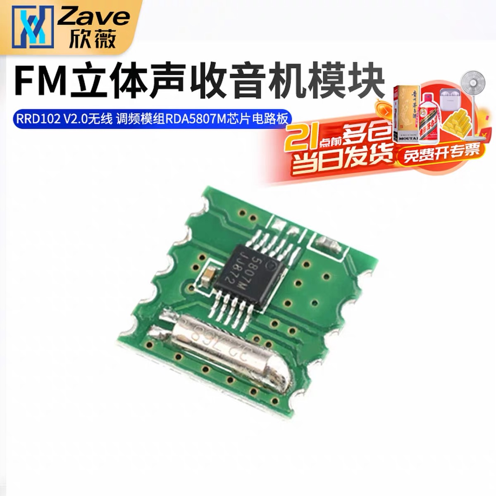
5. 0.91 寸 OLED模块
   - Image: 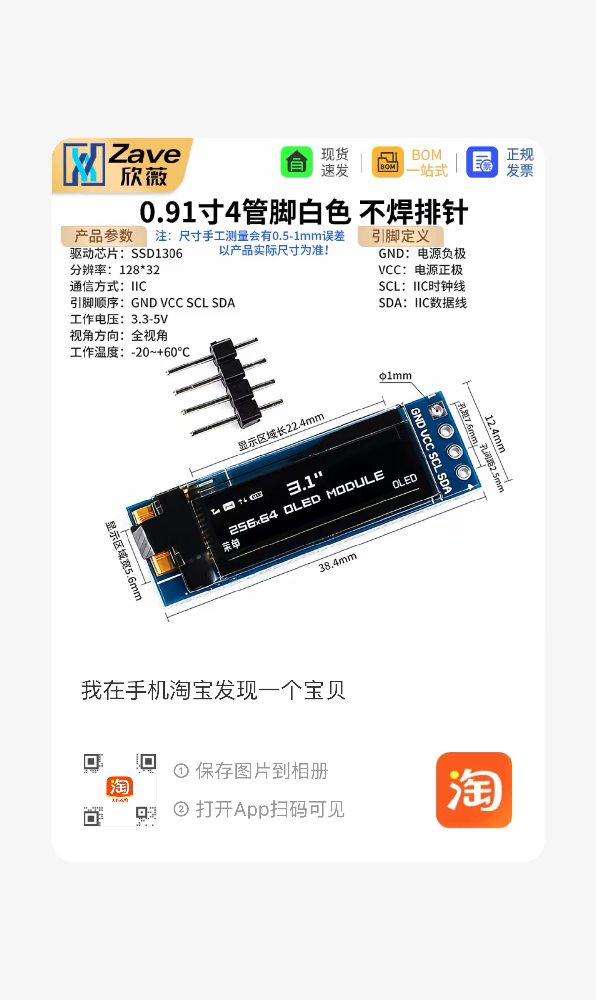
6. 18650电池盒 * 2
7. 松下NCR18650B电池 * 2
8. 2寸全频喇叭一个 4欧姆 外径66mm
   - Image: 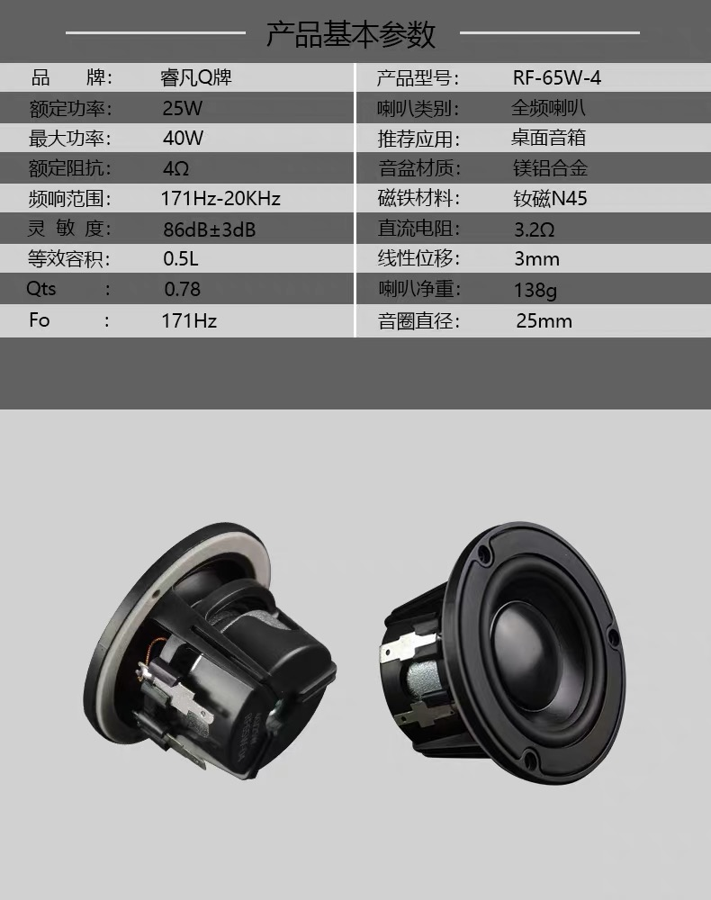
9. KNS-1拨动开关 * 2
   - Image: 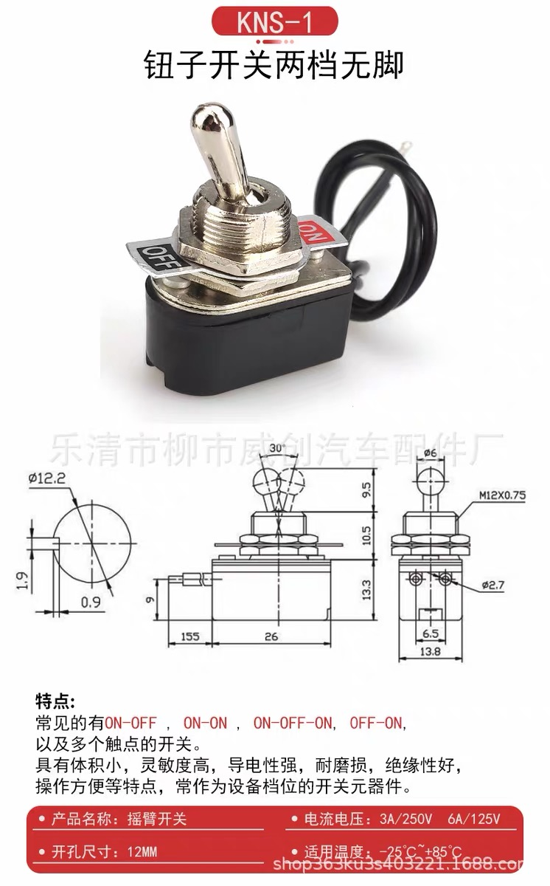
10. SMA转接线
   - Image: 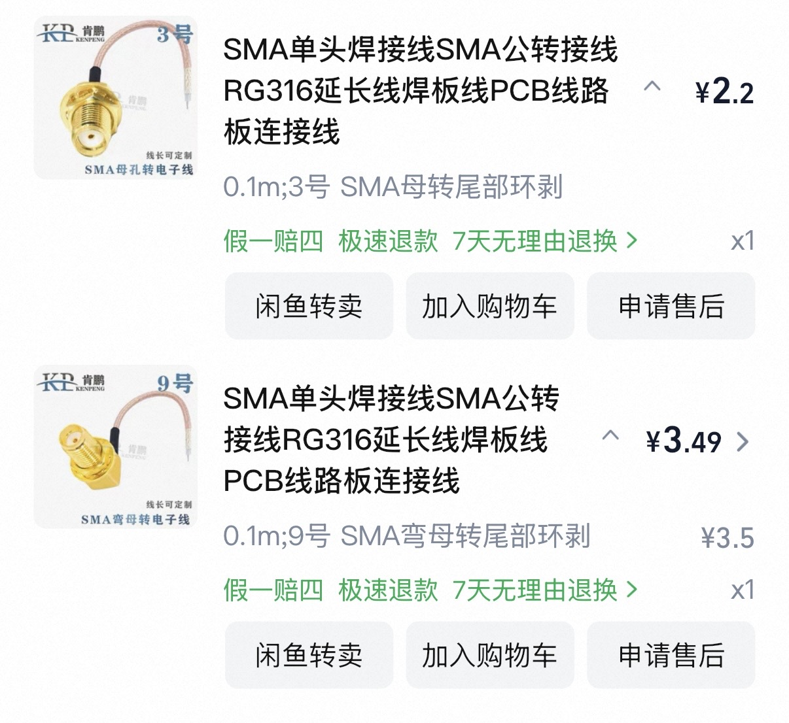
11. PAM8406
   - Image: 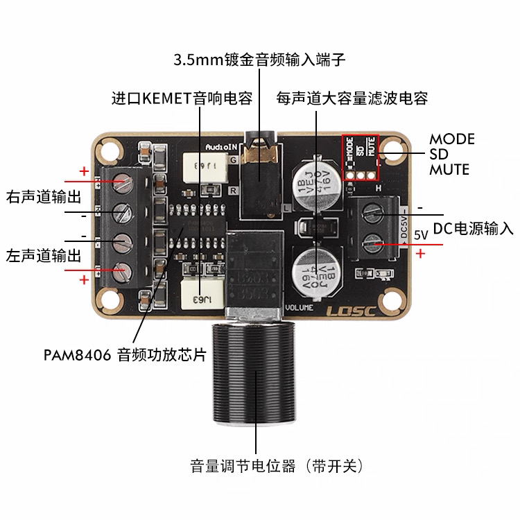
12. 实验板 6*8cm
   - Image: 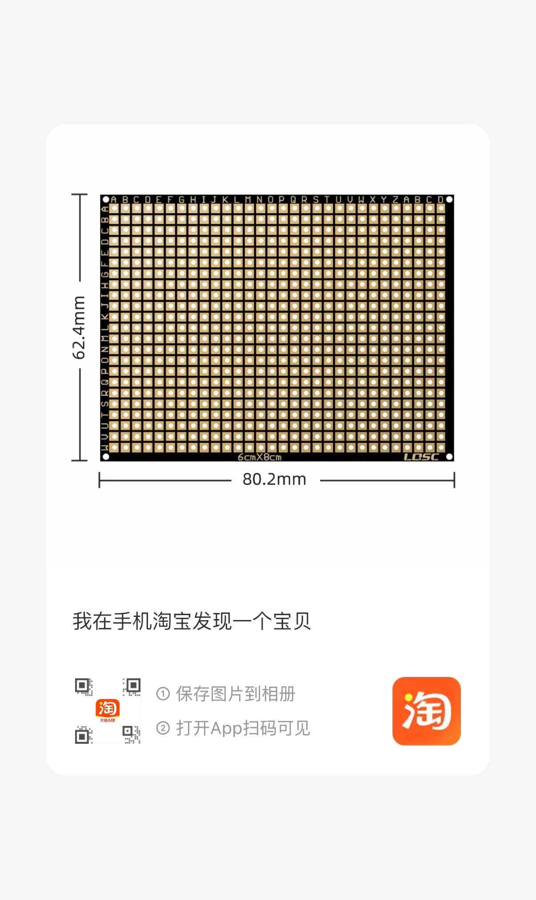
13. SMA拉杆天线 7节 16.3cm收 75.2cm展开
14. 台湾钮子开关
   - Image: 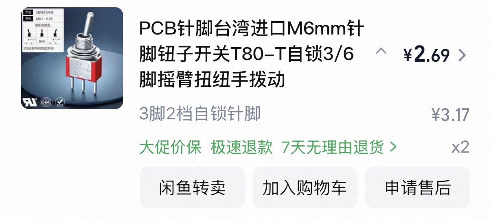
15. SI4713
   - Image: 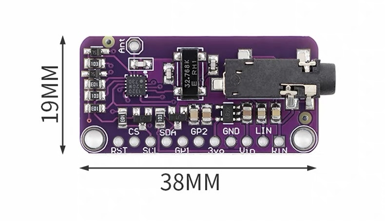
16. EC-11电位器梅花柄
   - Image: 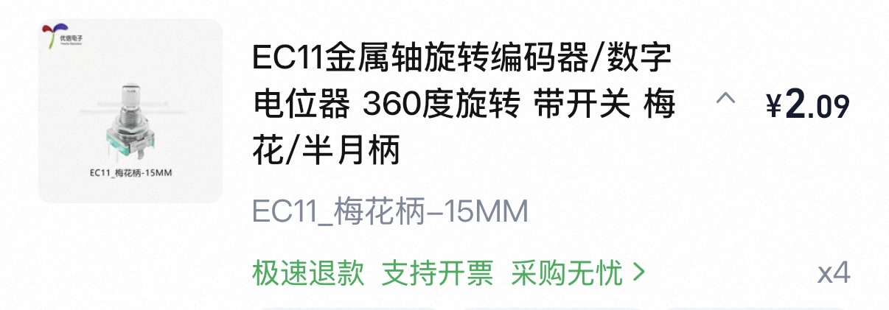
17. Seeed Xiao esp32c3 * 2
18. 胶木旋钮，直径15.5mm高14.5mm，内孔6mm和6.4mm
19. 可口可乐世界杯纪念版500ml * 3
   - Image: 
20. 5v充放电模块
   - Image: 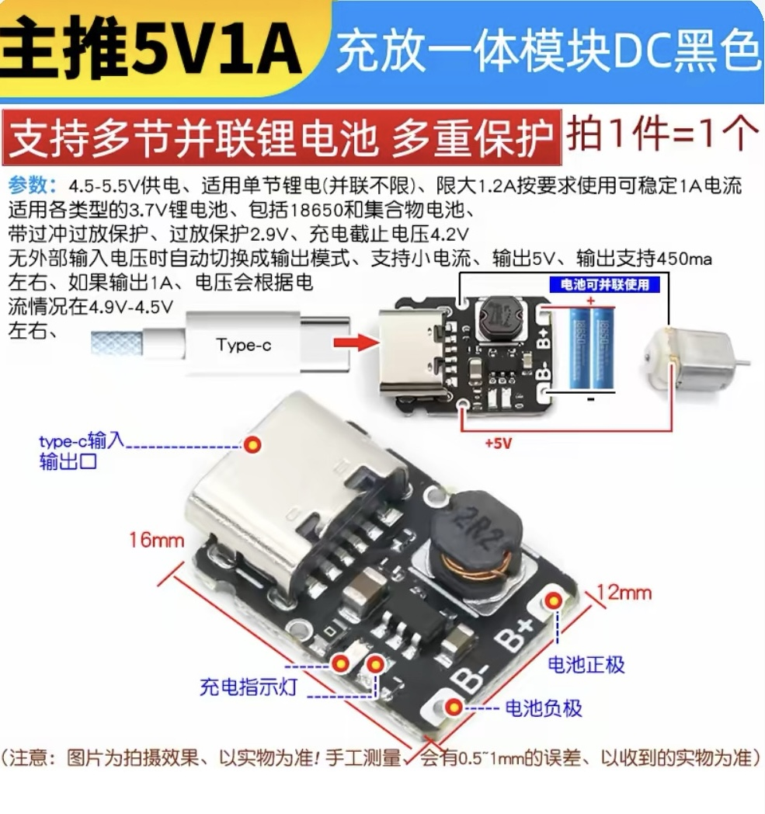
21. eva背胶带
   - Image: 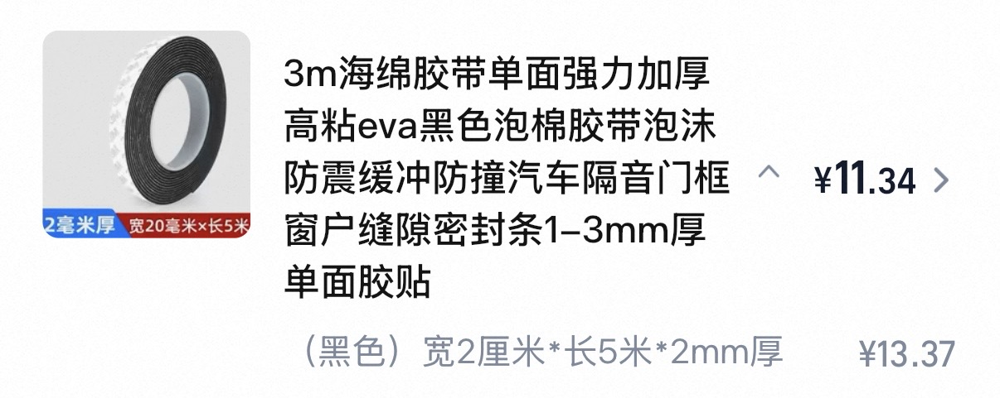
22. 0.35 mm² 单晶铜镀银特富龙软线天线，1 m
   - Image: 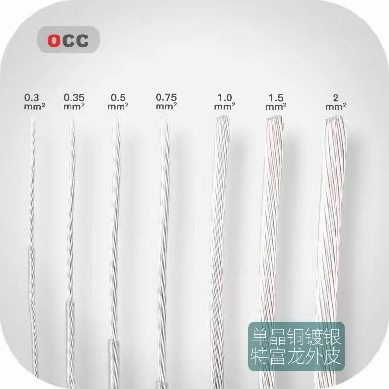

## Grouped View

### Controls / UI
- 电位器旋钮单圈碳膜电位器可调电阻2K欧姆 * 2
- 松下 6*6*4.3 直插2脚方形轻触开关 * 50
- 松下 6*6*5 直插2脚方形轻触开关 * 50
- KNS-1拨动开关 * 2
- 台湾钮子开关
- EC-11电位器梅花柄
- 胶木旋钮，直径15.5mm高14.5mm，内孔6mm和6.4mm

### Radio / RF
- RDA5807M 收音模块 * 2
- SMA转接线
- SMA拉杆天线 7节 16.3cm收 75.2cm展开
- SI4713
- 0.35 mm² 单晶铜镀银特富龙软线天线，1 m（当前 V0 软线天线）

### Display / MCU
- 0.91 寸 OLED模块
- Seeed Xiao esp32c3 * 2

### Power
- 18650电池盒 * 2
- 松下NCR18650B电池 * 2
- 5v充放电模块

### Audio
- 2寸全频喇叭一个 4欧姆 外径66mm
- PAM8406

### Build / enclosure
- 实验板 6*8cm
- 可口可乐世界杯纪念版500ml * 3
- eva背胶带

## Inspection Notes
- **Good coverage:** You have the core chain for an FM receiver prototype: MCU + RDA5807M + OLED + buttons/encoder + amplifier + speaker + antenna + battery power + can enclosure. The added `0.35 mm² × 1 m` silver-plated OCC/PTFE soft wire is suitable as the first wire antenna.
- **Likely mismatch: 2K potentiometer:** For audio volume into a PAM8406 board, 10K–50K audio/log taper is more typical. A 2K pot may load the source too heavily unless the specific PAM8406 board is designed for it.
- **Power architecture needs verification:** Check whether the `5v充放电模块` provides battery protection, charging, boost output, and enough current for ESP32C3 + PAM8406 peaks. If not, add protected 18650/charger/boost pieces or use the XIAO charger path carefully.
- **Missing consumables/connectors:** The antenna wire is now covered, but still check pin headers, Dupont/JST leads, heat-shrink, screws/standoffs, insulating sheet, and strain relief for the can exit hole. These are often the first build blockers.
- **Missing small passives may be needed:** Depending on exact modules: pull-up resistors are usually built into I2C modules or can use MCU internal pulls for buttons, but audio coupling capacitors, decoupling capacitors, and a few 1K–10K resistors are useful to have.
- **Speaker count/design choice:** One 4Ω full-range speaker is fine for mono. PAM8406 is commonly stereo; decide whether to use one channel only, mix to mono upstream, or add a second speaker.
- **SI4713 is probably optional/advanced:** SI4713 is an FM transmitter chip/module, not needed for a basic receive-only tin-can radio. Keep it as a later “broadcast/tin-can talkback” experiment.
- **Can enclosure safety:** Coke cans are conductive and sharp after cutting. Plan insulation around boards/battery, rounded edges, grommets for antenna/switch holes, and keep antenna ground/mechanics deliberate.

## Quick Next Purchase / Check List
- Confirm exact `PAM8406` board input/volume wiring and buy a `10K–50K audio/log potentiometer` if needed.
- Add pin headers, Dupont/JST connector leads, heat-shrink tubing, small screws/standoffs, and insulation sheet/fishpaper. For the soft antenna wire, prepare one solid jumper-pin pigtail or crimp terminal so it can plug into the breadboard reliably.
- Keep a resistor/capacitor assortment nearby: `1K`, `4.7K`, `10K`, `100nF`, `10µF`, `100µF`, plus audio coupling caps if the amp board lacks them.
- Verify the `5v充放电模块` datasheet/current rating and battery-protection behavior before installing in a metal can.
- Decide mono vs stereo: one speaker is enough for the tin-can concept, but plan the PAM8406 channel usage.
